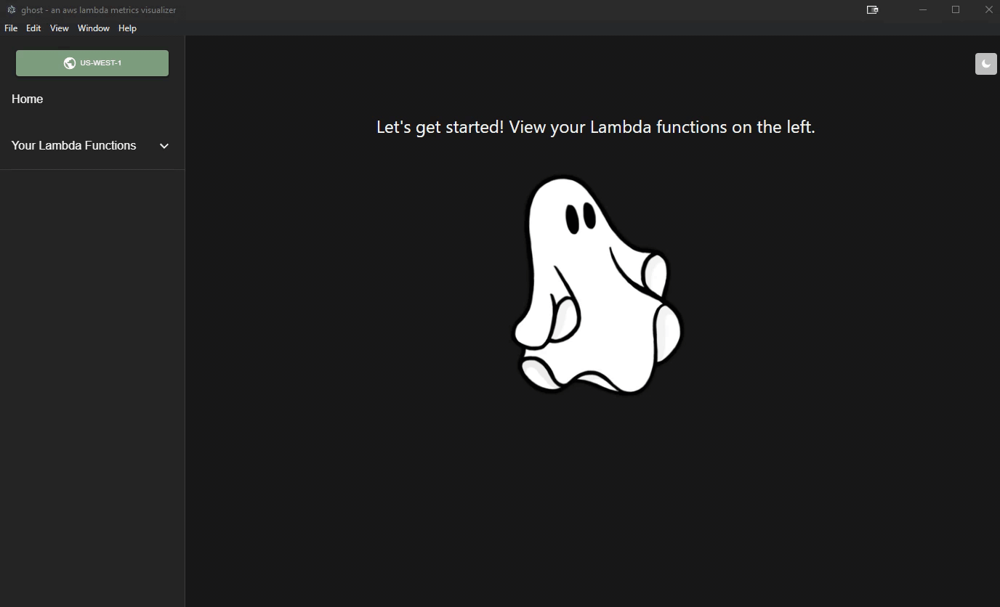

<p align='center'></p>

# ghost

## Getting Started
First, please log into Amazon Web Services (AWS). Ghost works best when the AWS Command Line Interface (CLI) is installed on your computer.


[Log into AWS](https://signin.aws.amazon.com/signin?redirect_uri=https%3A%2F%2Fconsole.aws.amazon.com%2Fconsole%2Fhome%3FhashArgs%3D%2523%26isauthcode%3Dtrue%26state%3DhashArgsFromTB_us-west-2_3def78f93219f346&client_id=arn%3Aaws%3Asignin%3A%3A%3Aconsole%2Fcanvas&forceMobileApp=0&code_challenge=8I-LvSUOJq5oXg_UEBENvX3DmGuddz2I9ScmMDvYY64&code_challenge_method=SHA-256)

[Install AWS CLI](https://docs.aws.amazon.com/cli/latest/userguide/getting-started-install.html)

<br />

## Configuration
Configure the AWS CLI with your user profile in your terminal of choice.


```
aws configure
```
You will need your security credentials (Access Key ID and Secret Access Key), AWS Region, and output format. You can just press 'enter' if the default values match yours.

```
AWS Access Key ID:
AWS Secret Access Key:
Default region name [us-west-1]:
Default output format [json]:
```
<br />

## Download and Launch
Download ghost from the GitHub repository under 'Releases.' Currently, there are releases for [Mac OS](https://www.google.com/) and [Windows](https://www.google.com/).

<i><b>On MacOS:</b></i>
Open the .dmg file to place ghost into your Applications folder.
Click on ghost in Applications to launch the app.

<i><b>On Windows:</b></i>
Do something

Now that ghost is ready to go, let's get started!

<br />

## Metrics
To view any graphs or data, you need to first select the Lambda Function you would like to view metrics for. Press 'Your Lambda Functions' on the left menu, then click the 'METRICS' button under the Lambda Function. Here are some basic metrics of your Lambda Function.  

For customized graphs and to see more metrics, select the Lambda Function you would like to create a custom graph for and view its metrics. Then click the orange 'CREATE GRAPH' button in the top right corner to display the graph creation user interface. Enter a title, select a metric, graph type, date/time range (end time must be within 24 hours from the start time), and then hit the 'SUBMIT' button.


<br />

## Pricing
To view the pricing calculator and previous billing history, first select the Lambda Function you would like to view pricing data for from the left menu. Click the 'PRICING' button under the specific Lambda Function. This will bring up the pricing calculator. Select type, memory size, storage size, billed duration, and total invocations. Click the 'CALCULATE PRICE' button when you are ready.

To view past billing history, click the 'HISTORY' tab when you are in the pricing calculator user interface for that specific Lambda function. Select your month and year then click 'SUBMIT'. Your previous total cost for that month will be displayed.


<br />

## Permissions
Select the Lambda Function you would like to view/edit permissions for in the left menu. Under the selected Lambda Function, click the 'PERMISSIONS' button. This will show the permissions UI and 'LIST OF PERMISSIONS' is the default tab. Here you can view all your permissions' information. If you want to delete any, simply click on the 'DELETE PERMISSION' button under the specific permission you wish to delete.

To add permissions, click on the 'ADD NEW PERMISSIONS' tab on top. Enter a Statement ID (cannot contain spaces), select an action, add a Principal, Principal Organization ID (optional), and then click 'ADD PERMISSION'. Your new permission has been added and can be seen on the 'LIST OF PERMISSIONS' tab now!



<br />

## Technologies Used
* Electron
* TypeScript
* React
* React Router
* Node.js
* Express
* Chart.js
* MaterialUI
* Tailwind CSS
* Jest
* Supertest

<br />

## Report an Issue
Encountered a problem with our application? [Submit a ticket](https://github.com/oslabs-beta/ghost/issues) to our GitHub under 'Issues.' Please be as descriptive as possible.

<br />

## Contribute
Interested in contributing to ghost or the Open Source community? The following is a list of features that the ghost team has either started or would like to implement. If you also have additional ideas, feel free to iterate off of ghost and implement those features!

* Additional testing
* Alerts
* Search for your function

<br />

<i><b>To contribute:</b></i>
* Fork the repository to your GitHub account.
* Clone the project on your machine.
* Create a branch for the issue you would like to work on.
* Once completed, submit a pull request. A member of our team will review it as soon as we can!

<br />

## Meet the Team
* Krisette Odegard - [LinkedIn](https://www.linkedin.com/in/krisette) | [GitHub](https://github.com/krisette)
* Akash Patel - [LinkedIn](https://www.linkedin.com/in/akashpatel1198/) | [GitHub](https://github.com/akashpatel1198)
* Tim Kang - [LinkedIn](https://www.linkedin.com/in/tkkang/) | [GitHub](https://github.com/tkang611)
* Tracy Chang - [LinkedIn](https://www.linkedin.com/in/tracycchang/) | [GitHub](https://github.com/tracycchang)
* Lisa Tian - [LinkedIn](https://www.linkedin.com/in/lisatian-/) | [GitHub](https://github.com/lisatiann)
